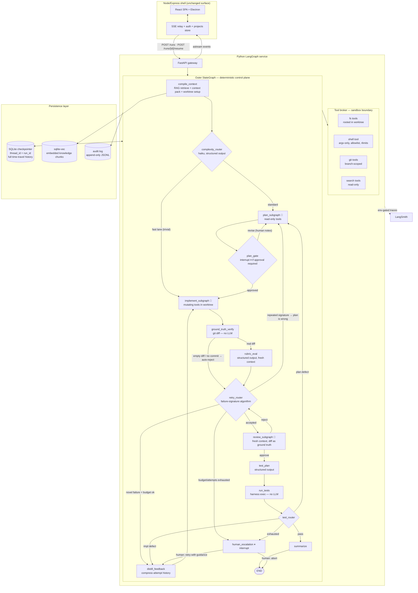

# Deem v2 — Production Blueprint: LangGraph Orchestration Service

**Status:** Approved design (discovery answers 2026-07-12) · **Supersedes:** the hand-rolled
phase machine in `server/workflow.js` · **Companion docs:** `docs/ARCHITECTURE.md` (v1
rationale), `docs/AI-CODING-AGENT-ARCHITECTURAL-BLUEPRINT.md` (verification theory — its
ground-truth invariants are carried forward here).

## 0. Decisions locked in discovery

| Question | Decision |
|---|---|
| Runtime | **Python LangGraph service** (FastAPI + `langgraph`), Node/Express becomes UI shell, auth, SSE relay, Electron host |
| LLM binding | **Full LangChain API agents** — `ChatAnthropic` + first-party tools replace the `claude -p` / `codex exec` subprocess adapters |
| Autonomy | **Deterministic gated outer graph, agentic inner subgraphs** — routers and gates are code; only the inside of a phase is model-driven |
| Pain to fix | Failure-repeating retries · rigid phase order · context/memory management · coarse recovery + no mid-run HITL |

Standing assumptions (unchanged from v1 unless revisited): local-first single-user
deployment; SQLite for run state; LangSmith tracing **opt-in via env** because runs touch
private repositories.

The v1 prime invariant survives intact and is enforced by graph topology, not prompts:
**agent claims are hypotheses; only harness-observed ground truth (git objects, exit
codes) mutates acceptance state.**

---

## 1. System Architecture Diagram



Diamonds are **router functions (pure code)**; 🤖 marks nodes that are themselves compiled
agentic subgraphs; ⏸ marks `interrupt()` points where the graph checkpoints and suspends
until `Command(resume=...)` arrives.

Key topological property: every LLM-driven node exits into a code-driven gate. There is no
edge from one model output directly into another model's authority — the control plane is
deterministic end to end.

---

## 2. State Schema & Data Flow

One outer schema, strongly typed with Pydantic models inside a `TypedDict` (LangGraph's
reducer machinery works on the top-level keys; Pydantic validates the payloads).

```python
# deemsvc/state.py
import operator
from typing import Annotated, Literal, TypedDict
from pydantic import BaseModel, Field

Phase = Literal[
    "compile", "plan", "plan_gate", "implement", "verify",
    "rubric", "review", "test_plan", "test", "summarize", "escalated", "done",
]

class TaskSpec(BaseModel):
    """Frozen at ingest. Never mutated afterwards — the pinned intent every
    evaluator judges against (prevents goal drift across retries)."""
    run_id: str
    project_root: str          # user's repo; agent works in a derived worktree
    branch: str                # task/<slug>
    title: str
    description: str
    requirements: list[str]
    spec_digest: str           # sha256 of the above; embedded in every eval prompt

class RunConfig(BaseModel):
    max_impl_attempts: int = 4
    max_plan_revisions: int = 2
    token_budget: int = 2_000_000
    reserve_floor: int = 100_000      # never start an attempt that can't afford verification
    rubric_threshold: int = 42        # of 60, carried over from v1
    require_plan_approval: bool = False
    fast_lane_enabled: bool = True

class ExecutionEvidence(BaseModel):
    """Computed by the harness from git. The model NEVER writes this."""
    head_sha: str
    diff_stat: str
    files_changed: list[str]
    insertions: int
    deletions: int
    empty: bool

class RubricResult(BaseModel):
    scores: dict[str, int]           # 6 criteria × 0–10
    total: int
    accepted: bool
    failure_reasons: list[str]

class ReviewFinding(BaseModel):
    file: str
    evidence: str                    # required citation — 'file: what was observed'
    severity: Literal["blocker", "major", "minor"]
    summary: str

class ReviewResult(BaseModel):
    verdict: Literal["approve", "reject"]
    findings: list[ReviewFinding]

class TestCase(BaseModel):
    id: str
    command: list[str]               # argv — executed by the harness, never a shell string
    kind: Literal["auto", "manual"]

class TestOutcome(BaseModel):
    case_id: str
    exit_code: int
    passed: bool                     # derived from exit_code by the harness
    tail: str                        # last N lines of output for feedback distillation

class TokenLedger(BaseModel):
    spent_in: int = 0
    spent_out: int = 0
    cost_usd: float = 0.0
    by_node: dict[str, int] = Field(default_factory=dict)

def merge_ledger(a: TokenLedger, b: TokenLedger) -> TokenLedger:
    merged = dict(a.by_node)
    for k, v in b.by_node.items():
        merged[k] = merged.get(k, 0) + v
    return TokenLedger(
        spent_in=a.spent_in + b.spent_in,
        spent_out=a.spent_out + b.spent_out,
        cost_usd=a.cost_usd + b.cost_usd,
        by_node=merged,
    )

class DistilledFeedback(BaseModel):
    """What the next implement attempt actually receives — never raw transcripts."""
    attempt: int
    strategy_hint: str               # mutated per attempt so retries differ (fixes 'same failure repeated')
    rubric_failures: list[str]
    review_blockers: list[str]
    failing_tests: list[str]

class RunState(TypedDict):
    # ---- frozen intent ----
    task: TaskSpec
    config: RunConfig
    # ---- control plane (routers read these; only code writes them) ----
    phase: Phase
    attempts: dict[str, int]                       # per-node loop counters
    complexity: Literal["trivial", "standard"]
    # ---- artifacts (one writer node each) ----
    context_pack: str                              # RAG chunks + skills, budget-trimmed
    plan: str | None
    execution: ExecutionEvidence | None            # written ONLY by ground_truth_verify
    rubric: RubricResult | None
    review: ReviewResult | None
    test_plan: list[TestCase] | None
    test_results: list[TestOutcome] | None
    summary: str | None
    # ---- loop intelligence ----
    failure_signatures: Annotated[list[str], operator.add]   # append-only
    feedback: DistilledFeedback | None
    # ---- accounting & audit ----
    ledger: Annotated[TokenLedger, merge_ledger]
    errors: Annotated[list[str], operator.add]
    # ---- HITL ----
    approvals: dict[str, str]                      # gate name → decision payload
```

### Data-flow rules (enforced by convention + review, cheap to lint)

1. **Single-writer keys.** Each artifact key has exactly one producing node
   (`execution` ← `ground_truth_verify`, `rubric` ← `rubric_eval`, …). Reducers
   (`operator.add`, `merge_ledger`) exist only on genuinely concurrent-append keys.
2. **Frozen intent.** `task` and `config` are written once at ingest. Every evaluator
   prompt embeds `spec_digest`, so a drifted spec is detectable in traces.
3. **Inner subgraphs have private state.** The implementer's message history lives in the
   *subgraph's* schema (`messages: Annotated[list, add_messages]`) and is summarized at the
   boundary — the outer state never accumulates raw transcripts. This is the structural fix
   for context-window blowups: the outer state stays kilobytes-sized for the whole run.
4. **Checkpointing.** `AsyncSqliteSaver`, `thread_id = run_id`. Every super-step persists,
   giving: crash resume from the exact node (fixes coarse recovery), `interrupt()`-based
   HITL, and `graph.get_state_history()` for time-travel debugging (re-fork a run from any
   checkpoint with edited state to reproduce a failure).

### Failure signatures (the retry/escalate algorithm)

```python
def failure_signature(state: RunState) -> str:
    basis = {
        "rubric": sorted(state["rubric"].failure_reasons) if state["rubric"] else [],
        "review": sorted(f.summary for f in state["review"].findings
                         if f.severity == "blocker") if state["review"] else [],
        "tests":  sorted(t.case_id for t in (state["test_results"] or []) if not t.passed),
        "empty_diff": state["execution"].empty if state["execution"] else True,
    }
    return hashlib.sha256(json.dumps(basis, sort_keys=True).encode()).hexdigest()[:16]
```

Same signature twice in a row = the generator is looping on the same wall → the problem is
upstream (plan) or unsolvable at this autonomy level (escalate). Novel signature = progress,
retry with a mutated strategy hint. This replaces v1's "retry up to 4 times with the same
feedback" — the confirmed top friction point.

---

## 3. Node & Component Breakdown

### Model tiers and fallback chain (shared factory)

```python
# deemsvc/models.py
from langchain_anthropic import ChatAnthropic

def strong_llm():   # implementation, review, planning
    primary = ChatAnthropic(model="claude-fable-5", max_tokens=16_384,
                            max_retries=4, timeout=180)
    return primary.with_fallbacks([ChatAnthropic(model="claude-opus-4-8")])

def fast_llm():     # routers, classification, distillation, summaries
    return ChatAnthropic(model="claude-haiku-4-5-20251001", max_retries=4) \
        .with_fallbacks([ChatAnthropic(model="claude-fable-5")])
```

`with_fallbacks` fires on rate limits / overloads after `max_retries` exponential backoff
is exhausted — requirement 3's structural fallback, at the model layer where it belongs.
Note the fast tier falls *up* on failure: availability beats cost for a control-plane call.

### Tool broker (the sandbox boundary — requirement 4's isolation seam)

All tools are `@tool`-decorated functions closed over a `Worktree` handle. No tool accepts
an absolute path or shell string; paths are resolved and jailed to the worktree root,
processes are spawned argv-only with a scrubbed env, rlimits, and process-group kill on
timeout. This is the layer that replaces what the Claude Code CLI previously provided,
and it is deliberately its own module with zero imports from graph code.

| Toolset | Tools | Granted to |
|---|---|---|
| `read_only` | `read_file`, `list_dir`, `grep`, `git_log`, `git_show` | planner, reviewer |
| `mutating` | `read_only` + `write_file`, `edit_file`, `git_add_commit` | implementer only |
| `exec` | `run_command` (argv allowlist: package manager, test runner, linter) | implementer, `run_tests` harness |

### Outer-graph nodes

| Node | Type | Model / tools | Responsibility |
|---|---|---|---|
| `compile_context` | deterministic | sqlite-vec retriever | Create/reuse worktree on `task/<slug>`; embed task text, retrieve top-k knowledge chunks + project skills; assemble a token-budgeted context pack. Upgrades v1's keyword-scored RAG to embeddings (confirmed friction). |
| `complexity_router` | router (LLM-assisted, structured) | `fast_llm().with_structured_output(Complexity)` | `trivial` → fast lane straight to implement (skip plan/review, keep tests); `standard` → full pipeline. Fixes "no fast lane". The LLM proposes; code applies config guardrails (fast lane can be disabled). |
| `plan_subgraph` 🤖 | agentic subgraph | `strong_llm()` + `read_only` tools, `create_react_agent` | Explores the repo, produces a stepwise plan with file-level targets and risk notes. Private message state; returns only the plan artifact + a one-paragraph exploration summary. |
| `plan_gate` | gate, may `interrupt()` | none | If `require_plan_approval`: `interrupt({"plan": …})` → UI renders approve / revise-with-notes. Human notes route back into `plan_subgraph`. Otherwise auto-approve. |
| `implement_subgraph` 🤖 | agentic subgraph | `strong_llm()` + `mutating` + `exec` tools | Receives plan + context pack + `DistilledFeedback` (never prior transcripts). Edits, self-checks with the toolchain, commits to the task branch. A `pre_model_hook` trims/summarizes its own history when near the context limit. Hard caps: max tool calls, per-attempt token slice from the ledger. |
| `ground_truth_verify` | deterministic | git only | Computes `ExecutionEvidence` from `git diff` on the branch. Empty diff / no commit → auto-reject regardless of what the agent claimed. Sole writer of `execution`. |
| `rubric_eval` | LLM, fresh context | `strong_llm().with_structured_output(RubricResult)` | Scores the *diff* (not the transcript) against the 6-criteria rubric and `spec_digest`. Validation-failure retry, then fallback model — an unparseable verdict never crashes the run. |
| `retry_router` | router (pure code) | none | The failure-signature algorithm (§2) + budget/attempt guards. Emits `implement` / `plan` / `review` / `escalate`. |
| `distill_feedback` | LLM | `fast_llm()` | Compresses rubric failures, review blockers, and failing-test tails into `DistilledFeedback` with a **strategy hint that must differ from prior attempts** (hints are accumulated in state and excluded). |
| `review_subgraph` 🤖 | agentic subgraph, fresh context | `strong_llm()` + `read_only` tools | Never sees the generator's conversation. Input: diff + pinned criteria. Every finding requires a `file: evidence` citation; uncited findings are dropped by the output validator. |
| `test_plan` | LLM | `strong_llm().with_structured_output(list[TestCase])` | Derives auto test cases (argv commands) + manual checks from requirements + diff. |
| `run_tests` | deterministic | `exec` toolset (harness-invoked) | Executes every auto case; `passed` comes from exit codes only. Sole writer of `test_results`. |
| `test_router` | router (pure code) | none | Failures classified by signature: impl defect → `distill_feedback`; requirement-level mismatch or repeated signature → `plan`; pass → `summarize`; guards exhausted → `escalate`. |
| `summarize` | LLM | `fast_llm()` | Human-facing run summary from artifacts (not transcripts). |
| `human_escalation` | gate, `interrupt()` | none | Suspends with full evidence bundle. Human resumes with guidance (→ `distill_feedback`) or aborts. Replaces v1's silent "budget exhausted, task failed". |

### Graph wiring — loop-guard pattern (requirement 2)

```python
def retry_router(state: RunState) -> Literal["review", "implement", "plan", "escalate"]:
    cfg, att = state["config"], state["attempts"]
    if state["rubric"] and state["rubric"].accepted and not state["execution"].empty:
        return "review"
    if (state["ledger"].spent_out >= cfg.token_budget - cfg.reserve_floor
            or att.get("implement", 0) >= cfg.max_impl_attempts):
        return "escalate"                                   # absolute bounds first
    sigs = state["failure_signatures"]
    if len(sigs) >= 2 and sigs[-1] == sigs[-2]:             # looping on the same wall
        return "plan" if att.get("plan", 0) < cfg.max_plan_revisions else "escalate"
    return "implement"                                       # novel failure → progress

builder.add_conditional_edges("rubric_eval", retry_router, {
    "review": "review_subgraph", "implement": "distill_feedback",
    "plan": "plan_subgraph", "escalate": "human_escalation",
})
```

Every cycle in the graph passes through a router that checks an attempt counter **and** the
token ledger **and** signature history; `recursion_limit=150` on the run config is the
final backstop. Three independent guards — a bug in one cannot produce an unbounded loop.

### Service surface & Node-shell contract

```
POST /runs                      {task, config}         → {run_id}
GET  /runs/{id}/events          SSE: node updates, tool activity, token ticks, interrupts
POST /runs/{id}/resume          {gate, decision, notes} → Command(resume=…)
GET  /runs/{id}/state           latest checkpoint snapshot (drives task tabs)
GET  /runs/{id}/history         checkpoint list (time-travel debug UI)
POST /runs/{id}/fork            {checkpoint_id, state_patch} → new run from past state
GET  /health
```

The Node shell keeps auth, projects/users store, Telegram/Command Center, exporters, and
Electron; it relays the Python SSE stream onto the existing `/api/events` firehose so the
React app's event model is unchanged. Execution runtime (tool broker) ↔ orchestration
(graph) ↔ integrations (Node shell) are three cleanly separated layers — requirement 4.

---

## 4. Error Handling & Resiliency Matrix

| # | Failure mode | Detected by | First response | Structural fallback | Terminal behavior |
|---|---|---|---|---|---|
| 1 | Rate limit / API overload | SDK error class | `max_retries=4` exponential backoff in `ChatAnthropic` | `with_fallbacks` → alternate model (fable→opus; haiku→fable) | Node raises → run parks at last checkpoint, resumable; never lost |
| 2 | Tool failure (bad path, cmd error) | Tool wrapper catches, returns structured `ToolMessage` error | Error text fed back into the inner agent loop (self-correction) | Per-agent tool-error cap (e.g. 8) → subgraph exits "blocked", outer router treats as failed attempt | Counts toward `max_impl_attempts` → escalate |
| 3 | Context-window overflow (inner agent) | `pre_model_hook` token count vs. model limit | `trim_messages` keep-recent + pinned system/plan | Summarization pass replaces oldest turns with a `fast_llm` digest | Attempt aborted "context exhausted" — a failure signature, not a crash |
| 4 | Context bloat (outer state) | prevented by design | Outer state holds artifacts only, never transcripts (§2 rule 3) | Context pack budget-trimmed at compile time | n/a |
| 5 | Ambiguous / malformed model output | `with_structured_output` Pydantic validation | Auto re-prompt with validation errors (bounded) | Fallback model for the structured call | Verdict node marks attempt failed; router proceeds — no crash, no free-text parsing |
| 6 | Agent claims success, did nothing | `ground_truth_verify`: empty diff | Auto-reject regardless of self-report | Signature `empty_diff` → escalates fast on repeat | v1 prime invariant, now a graph edge |
| 7 | Uncited / hallucinated review findings | Reviewer output validator requires `file: evidence` | Uncited findings dropped | Zero valid findings + reject verdict → re-review once with warning | Reviewer disagreement surfaced to human at escalation |
| 8 | Infinite improvement loop | Signature repetition + attempt counters + ledger floor | Route to plan revision (new signature ≠ new attempt at same wall) | `recursion_limit=150` backstop | `human_escalation` with evidence bundle |
| 9 | Token budget exhaustion | Every router checks `ledger` vs. `reserve_floor` | Stop *before* starting an unaffordable attempt | Reserve floor guarantees verification of work already done | Escalate with partial results, never a half-verified merge |
| 10 | Process crash mid-run | Startup scan: threads with pending work, no active worker | Resume from last checkpoint — `astream(None, config)` re-enters at the interrupted node | Worktree is disposable: unverifiable partial file state → discard attempt, re-run from prior checkpoint | Audit log records crash + resume decision |
| 11 | Human never answers an interrupt | Run parked at checkpoint (costs nothing) | Shell-side reminder policy (existing Telegram path) | Config TTL → auto-abort with status `stale` | Explicit, audited abort |
| 12 | Test flake / env failure | `run_tests` distinguishes infra exit codes (127, timeout) from assertion failures | One infra-failure re-run of the case | Persistent infra failure → escalate as environment issue, not counted as an impl attempt | Human fixes env, resumes |

**Tracing (requirement 3):** `LANGSMITH_TRACING=true` env-gates everything; run metadata
tags `{run_id, project, phase, attempt}` on every trace; a redaction hook
(`hide_inputs`/`hide_outputs` anonymizer) strips file contents when
`DEEM_TRACE_REDACT=1`, so tracing on private code is opt-in twice.

---

## 5. Production Implementation Path

Each step lands with its own tests and is independently shippable; the v1 pipeline keeps
running until step 7 cuts over.

**Step 0 — Service scaffold.**
`deemsvc/` (uv-managed): `langgraph`, `langchain-anthropic`, `langgraph-checkpoint-sqlite`,
`fastapi`, `pydantic`, `sqlite-vec`. FastAPI skeleton with `/health`. CI: pytest + mypy
(the typed state schema should be machine-checked from day one).

**Step 1 — Foundational LangChain primitives (no graph yet).**
Model factory with fallback chains; all Pydantic artifact models; every structured-output
call (`RubricResult`, `ReviewResult`, `list[TestCase]`, `Complexity`) as standalone,
unit-testable functions with recorded-fixture tests.

**Step 2 — Tool broker.**
Worktree manager (port the semantics of `server/workspace.js`), jailed fs tools, argv-only
exec with rlimits, git tools. Test against a throwaway fixture repo: path escape attempts,
timeout kills, env scrubbing. **This is the security boundary — it gets the most tests.**

**Step 3 — Outer graph with stub nodes.**
Full `StateGraph` wiring with deterministic stub nodes (port `server/agents/mock.js`
behavior). Prove with the checkpointer: all routing paths, loop guards (force repeated
signatures → plan revision → escalation), interrupt/resume on `plan_gate`, crash-resume
(`SIGKILL` the process mid-run, restart, assert exact-node resume), time-travel forking.
*All control-plane logic is verified before a single real token is spent.*

**Step 4 — Inner agentic subgraphs.**
`create_react_agent`-based planner / implementer / reviewer with their tool grants,
`pre_model_hook` trimming, tool-error caps, and boundary summarization. Swap stubs one at a
time; golden-task integration tests on the fixture repo (e.g. "add a CLI flag + test") with
budget ceilings.

**Step 5 — RAG upgrade + feedback distillation.**
sqlite-vec embedding store replacing `server/rag.js` keyword scoring (measure retrieval
hit-rate against v1 on the same knowledge base); `distill_feedback` with strategy-hint
mutation. Verify empirically: seed a task that fails attempt 1, assert attempt 2's prompt
contains a different strategy and no raw transcript.

**Step 6 — Shell integration.**
Node gains a `deemsvc` client: run CRUD proxied to FastAPI, SSE relayed onto the existing
firehose, interrupt cards (plan approval, escalation) in the task UI, resume buttons wired
to `/resume`. Electron boots both processes; watchdog + graceful shutdown ports from
`server/index.js`.

**Step 7 — Tracing, evals, cutover.**
LangSmith env-gating + redaction hook. An eval suite of ~10 golden tasks scored on the
v1 promise (rubric pass-rate, attempts-to-accept, tokens-to-accept, zero empty-diff
accepts) — run 10× to measure variance, since *that* is the product. Shadow-run v2 next to
v1 on real tasks; cut the default over when v2's variance ≤ v1's; keep v1 behind a flag for
one release, then delete `server/workflow.js`.

**Explicit non-goals (revisit triggers):** multi-machine runners (revisit if agents must run
where the repo isn't), Postgres checkpointer (revisit at multi-user), LangGraph Platform
(revisit if orchestration ever separates from local execution).
